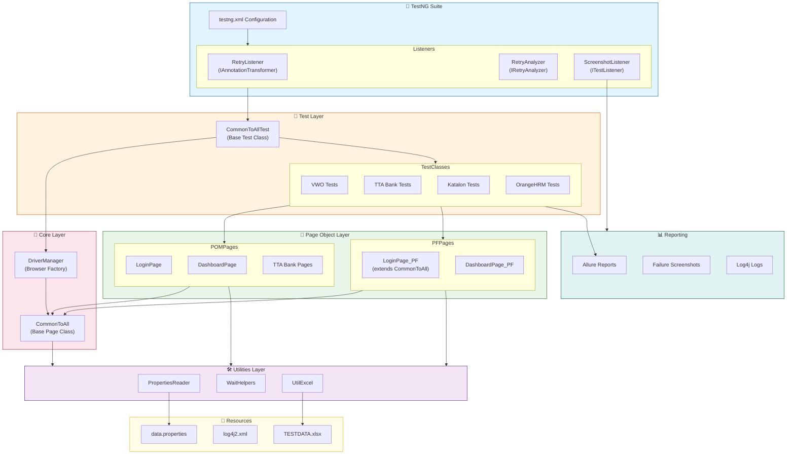

# Selenium Automation Framework (with Java)

Author - Pramod Dutta

## 🚀 Features

- Java, Selenium, TestNG
- Maven, AssertJ, POM
- Thread Local Support → Thread Safety
- Allure Report
- Excel Sheet for Test Data → Data Provider
- Read the username and password from Properties
- TestNG, @Test, Before and After Method
- Cloud Grids - Selenoid Docker integration
- SonarLint, Java > 8
- Run Local and on Selenoid Integration

---

## 📊 Framework Architecture Diagram



---

## 📁 Project Structure

```
ATB14xSeleniumAdvanceFramework/
├── src/
│   ├── main/
│   │   ├── java/com/thetestingacademy/
│   │   │   ├── base/
│   │   │   │   └── CommonToAll.java          # Base class with common actions
│   │   │   ├── driver/
│   │   │   │   └── DriverManager.java        # Browser factory & driver management
│   │   │   ├── pages/
│   │   │   │   ├── POM/                      # Page Object Model implementations
│   │   │   │   │   ├── vwo/
│   │   │   │   │   │   ├── normal_POM/       # Standard POM pages
│   │   │   │   │   │   └── improved_POM/     # Enhanced POM pages
│   │   │   │   │   ├── TTABank/              # TTA Bank page objects
│   │   │   │   │   └── katalonStudio/        # Katalon page objects
│   │   │   │   └── PF/                       # Page Factory implementations
│   │   │   │       └── vwo/
│   │   │   └── utils/
│   │   │       ├── PropertiesReader.java     # Configuration reader
│   │   │       └── WaitHelpers.java          # Wait utility methods
│   │   └── resources/
│   │       ├── data.properties               # Test configuration
│   │       └── log4j2.xml                    # Logging configuration
│   └── test/
│       ├── java/com/thetestingacademy/
│       │   ├── baseTest/
│       │   │   └── CommonToAllTest.java      # Base test with setup/teardown
│       │   ├── listeners/
│       │   │   ├── RetryAnalyzer.java        # Test retry logic
│       │   │   ├── RetryListener.java        # Retry annotation transformer
│       │   │   └── ScreenshotListener.java   # Failure screenshot capture
│       │   ├── tests/
│       │   │   ├── vwo/                      # VWO application tests
│       │   │   ├── TTABank/                  # TTA Bank tests
│       │   │   ├── orangeHRM/                # OrangeHRM tests
│       │   │   ├── katalonStudio/            # Katalon tests
│       │   │   └── idrive/                   # IDrive tests
│       │   └── utilsExcel/
│       │       └── UtilExcel.java            # Excel data reader
│       └── resources/
│           └── TESTDATA.xlsx                 # Test data file
├── allure-results/                           # Allure report data
├── failure_screenshots/                       # Failed test screenshots
├── logs/                                      # Application logs
├── pom.xml                                   # Maven configuration
└── testng_*.xml                              # TestNG suite files
```

---

## 🎯 OOP Concepts Used in This Framework

### 1. **Encapsulation** 🔒

Encapsulation is used to hide the internal state and require all interaction to be performed through object methods.

| Class | Implementation |
|-------|----------------|
| `DriverManager` | WebDriver instance is encapsulated with `getDriver()` and `setDriver()` methods |
| `LoginPage` | Page locators are `private` and accessed only through public action methods |
| `PropertiesReader` | File handling logic is encapsulated within `readKey()` method |
| `UtilExcel` | Excel workbook and sheet objects are `static` with controlled access |

```java
// Example from DriverManager.java
public static WebDriver driver;  // State
public static WebDriver getDriver() { return driver; }  // Getter
public static void setDriver(WebDriver driver) { DriverManager.driver = driver; }  // Setter
```

---

### 2. **Inheritance** 👪

Inheritance is used to create a hierarchy where child classes inherit properties and methods from parent classes.

| Parent Class | Child Class | Purpose |
|-------------|-------------|---------|
| `CommonToAll` | `LoginPage_PF` | Page Factory pages inherit common actions |
| `CommonToAllTest` | All Test Classes | Test classes inherit `@BeforeMethod` and `@AfterMethod` |
| `IRetryAnalyzer` | `RetryAnalyzer` | Implements retry logic interface |
| `ITestListener` | `ScreenshotListener` | Implements test listener interface |
| `IAnnotationTransformer` | `RetryListener` | Implements annotation transformer |

```java
// Example: Test class inheriting base test
public class TestVWOLogin_02_Prop_Improved_POM extends CommonToAllTest {
    // Inherits setUp() and tearDown() methods
}

// Example: Page Factory class inheriting CommonToAll
public class LoginPage_PF extends CommonToAll {
    // Inherits openVWOUrl(), clickElement(), enterInput(), getText()
}
```

---

### 3. **Polymorphism** 🔄

Polymorphism allows methods to behave differently based on the object/parameters.

#### Method Overloading (Compile-time Polymorphism)

| Class | Overloaded Methods |
|-------|-------------------|
| `CommonToAll` | `clickElement(By by)`, `clickElement(WebElement by)` |
| `CommonToAll` | `enterInput(By by, String key)`, `enterInput(WebElement by, String key)` |
| `CommonToAll` | `getText(By by)`, `getText(WebElement by)` |
| `WaitHelpers` | `checkVisibility(WebDriver, By, int)`, `checkVisibility(WebDriver, By)` |

```java
// Method Overloading in CommonToAll.java
public void clickElement(By by) {
    getDriver().findElement(by).click();
}

public void clickElement(WebElement by) {
    by.click();
}
```

#### Method Overriding (Runtime Polymorphism)

| Interface | Implementation | Overridden Method |
|-----------|---------------|-------------------|
| `IRetryAnalyzer` | `RetryAnalyzer` | `retry(ITestResult result)` |
| `ITestListener` | `ScreenshotListener` | `onTestFailure(ITestResult result)` |
| `IAnnotationTransformer` | `RetryListener` | `transform(...)` |

```java
// Method Overriding in RetryAnalyzer.java
@Override
public boolean retry(ITestResult result) {
    if (retryCount < maxRetryCount) {
        retryCount++;
        return true;
    }
    return false;
}
```

---

### 4. **Abstraction** 🎭

Abstraction hides complex implementation details and exposes only the essential features.

| Abstraction Type | Implementation |
|-----------------|----------------|
| **Interface Implementation** | `IRetryAnalyzer`, `ITestListener`, `IAnnotationTransformer` |
| **Page Object Pattern** | Test classes don't know about locators, only page actions |
| **Utility Classes** | `WaitHelpers`, `PropertiesReader` hide complex logic |

```java
// Abstraction through Page Object Model
// Test class only knows about loginToVWOInvalidCreds() method
// It doesn't know about internal locators or implementation
LoginPage loginPage = new LoginPage(driver);
String error_msg = loginPage.loginToVWOInvalidCreds(username, password);
```

---

### 5. **Composition** 🧩

Composition is used where classes contain instances of other classes.

| Container Class | Composed Object | Purpose |
|----------------|-----------------|---------|
| `LoginPage` | `WebDriver driver` | Page uses driver for browser operations |
| `LoginPage_PF` | `WebDriver driver` | Page Factory uses driver |
| `ScreenshotListener` | `WebDriver` | Listener uses driver for screenshots |

```java
// Composition in LoginPage.java
public class LoginPage {
    WebDriver driver;  // Composed object
    
    public LoginPage(WebDriver driver) {
        this.driver = driver;  // Dependency injection
    }
}
```

---

### 6. **Static Members** ⚡

Static members are used for shared resources and utility methods.

| Class | Static Usage |
|-------|-------------|
| `DriverManager` | `static WebDriver driver` - Shared across tests |
| `PropertiesReader` | `static String readKey()` - Utility method |
| `WaitHelpers` | All methods are `static` - Utility class |
| `UtilExcel` | `static Workbook`, `static Sheet` - Shared resources |

---

### 7. **Constructor Overloading & Dependency Injection** 💉

Constructors are used to inject dependencies into page objects.

```java
// Constructor injection in LoginPage.java
public LoginPage(WebDriver driver) {
    this.driver = driver;
}

// Constructor with PageFactory initialization in LoginPage_PF.java
public LoginPage_PF(WebDriver driver) {
    this.driver = driver;
    PageFactory.initElements(driver, this);
}
```

---

## 📐 Design Patterns Used

| Pattern | Implementation | Purpose |
|---------|---------------|---------|
| **Page Object Model (POM)** | `pages/POM/*` | Separates page elements from test logic |
| **Page Factory** | `pages/PF/*` with `@FindBy` | Lazy initialization of web elements |
| **Singleton-like** | `DriverManager` | Single point of driver management |
| **Factory Pattern** | `DriverManager.init()` | Creates browser instances based on config |
| **Listener Pattern** | TestNG Listeners | Event-driven test execution hooks |

---

## 🖼️ Screenshots


---

## 🐳 Selenoid - Docker Grid Running

- Selenoid is a powerful tool for running Selenium tests in Docker containers.
- It helps manage and scale test automation infrastructure efficiently.


---

## 🚀 How to Run

```bash
mvn test -Dsurefire.suiteXmlFiles=testng.xml
```

---

## 📦 Dependencies

| Dependency | Version | Purpose |
|------------|---------|---------|
| Selenium Java | 4.39.0 | Browser automation |
| TestNG | 7.10.2 | Test framework |
| AssertJ | 3.27.6 | Fluent assertions |
| Allure TestNG | 2.27.0 | Test reporting |
| Log4j | 2.23.1 | Logging |
| Apache POI | 5.2.5 | Excel file handling |